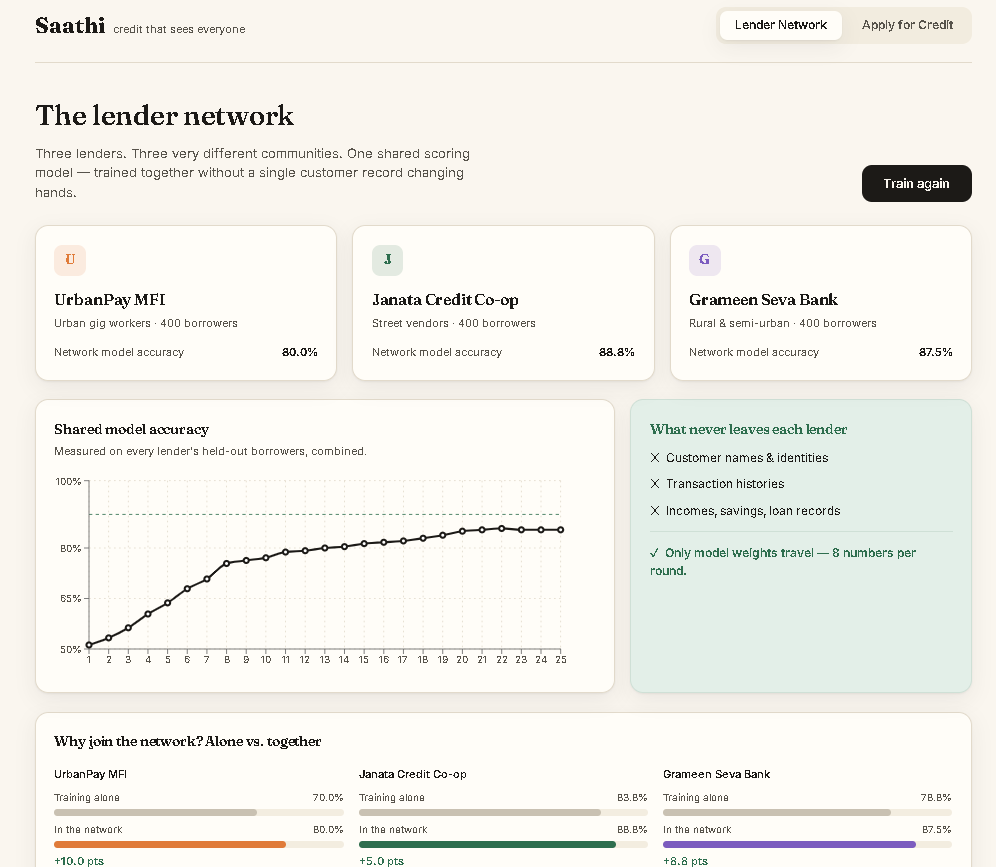
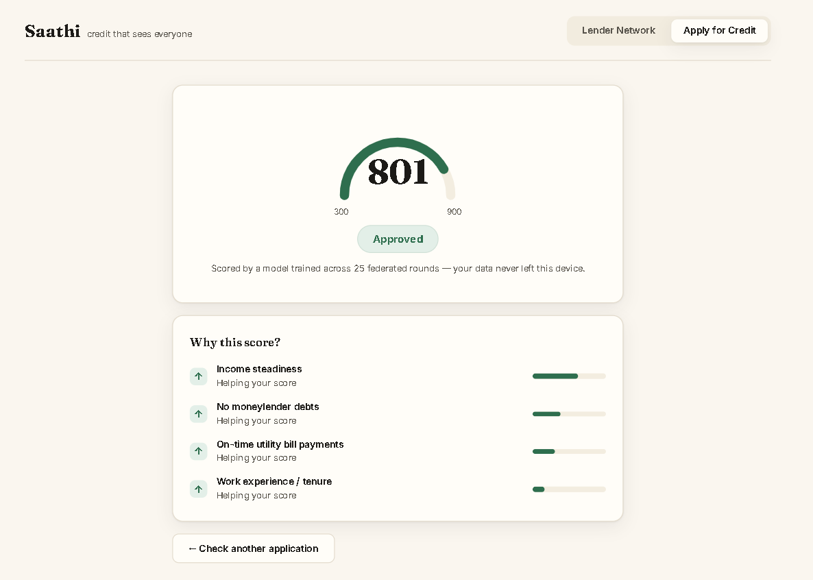

# Saathi Score

**Credit that sees everyone.**

A privacy-first alternative credit scoring platform for India's unbanked — street vendors, gig workers, and small farmers who are invisible to traditional credit systems because they have no CIBIL history.

Saathi scores people on the financial life they *actually* live — daily income, bill payments, savings habits, work tenure — and lets multiple lenders train a shared scoring model **without any customer's raw data ever leaving their own systems**, using federated learning.



*Three lenders training one shared model — accuracy climbs without any raw data leaving a lender.*



*An instant, explained score — every decision comes with its reasons.*

---

## The problem

Around 190 million Indian adults are unbanked. The ones who do earn — the vegetable seller, the auto driver, the seasonal farmer — get rejected for formal credit because they have no credit score. The data that *would* prove their creditworthiness (steady daily cash flow, on-time utility payments, years running a stall) is never used.

Meanwhile, the small lenders who serve these communities each hold too little data to build a good risk model alone, and privacy regulation — plus plain competitive sense — stops them from pooling raw customer records.

## The idea

1. **Alternative-data scoring.** No CIBIL score required. Eight signals from a person's real economic life produce a 300–900 Saathi Score with a plain-language explanation of *why*.
2. **Federated learning across lenders.** Three lenders serving very different communities train one shared model together. Only model weights — eight numbers per round — are exchanged. No names, no transactions, no incomes ever leave a lender.
3. **Explainability built in.** Every score comes with its top reasons, so a borrower learns what helped and what to improve — not a silent rejection.

## What makes it different

- **Federated, not centralized** — the privacy guarantee is structural, not a promise. Raw data physically never moves.
- **The underserved gain the most** — in testing, the smallest rural lender's model accuracy improved the most from joining the network, despite contributing the least data.
- **Honest, explainable decisions** — the model can say no, and tells you why, in human language.

---

## Architecture

```
┌──────────────────────────────────────────────────────────────────────┐
│                         SAATHI NETWORK (server)                        │
│                                                                        │
│                  ┌────────────────────────────────┐                    │
│                  │     Global scoring model        │                   │
│                  │   (logistic regression, NumPy)  │                   │
│                  └────────────────────────────────┘                    │
│                     ▲    weights only        │  weights only           │
│        ┌────────────┘    (8 numbers/round)   └────────────┐            │
│        │            FedAvg: weighted average of nodes      │           │
└────────┼───────────────────────┼──────────────────────────┼───────────┘
         │                        │                          │
   ┌─────┴──────┐          ┌──────┴──────┐            ┌──────┴───────┐
   │ UrbanPay   │          │   Janata    │            │  Grameen     │
   │   MFI      │          │  Credit     │            │  Seva Bank   │
   │            │          │  Co-op      │            │              │
   │ urban gig  │          │ street      │            │ rural &      │
   │ workers    │          │ vendors     │            │ semi-urban   │
   │            │          │             │            │              │
   │ 400 private│          │ 400 private │            │ 400 private  │
   │ borrowers  │          │ borrowers   │            │ borrowers    │
   └────────────┘          └─────────────┘            └──────────────┘
   trains locally          trains locally             trains locally
   on its own data         on its own data            on its own data

  Raw borrower data (names, incomes, transactions, loans)
  NEVER leaves a node. Only learned model weights are shared.
```

Borrower scoring flow:

```
   New borrower  ──►  8 alternative-data features
                          │
                          ▼
              Global federated model (trained)
                          │
          ┌───────────────┼───────────────┐
          ▼               ▼               ▼
    Saathi Score    Decision         Explanation
     (300–900)   approve / review   ranked per-feature
                    / decline       reasons (human text)
```

---

## How it works

**1. Synthetic, non-IID data (`data_generator.py`)**
Three lenders are given deliberately *different* borrower populations — urban gig workers (volatile income), street vendors (steady but small), and rural/seasonal earners (low digital footprint). Each borrower has eight alternative-data features and a repayment outcome generated from a hidden ground-truth relationship with realistic noise. This non-IID split is exactly the scenario federated learning is built for, and no real personal data is used anywhere.

**2. Federated training (`federated.py`)**
A logistic-regression model is implemented from scratch in pure NumPy. Each round, every lender trains a local copy on its own private data, and the server combines the results with **FedAvg** (a size-weighted average of the model weights). Repeating this over rounds produces a shared global model that has effectively learned from all three lenders' borrowers — while only ever exchanging weights, never data. The engine also computes each lender's accuracy *training alone* versus *in the network*, which surfaces the core result: underserved lenders gain the most.

**3. Scoring and explainability (`main.py`)**
A FastAPI server exposes the training loop and a scoring endpoint. A borrower's eight features are normalized and passed through the trained global model to get a repayment probability, which is mapped to a familiar 300–900 score band and an approve / review / decline decision. Crucially, every score is accompanied by **per-feature contributions** (weight × normalized value), ranked and translated into plain-language reasons so the applicant sees exactly what helped and what held them back.

**4. The interface (`frontend/`)**
Two views. The **Lender Network** dashboard animates federated training round by round — three live lender nodes, a climbing accuracy curve, a "what never leaves each lender" privacy panel, and an alone-vs-together comparison. The **Apply for Credit** view is the human side: a warm application form, an animated score reveal, and the explanation panel.

---

## Tech stack

- **Backend:** Python, FastAPI, NumPy. The federated learning engine and logistic-regression model are implemented from scratch — no heavyweight ML frameworks.
- **Frontend:** React (Vite), Recharts for the live training chart.
- **Data:** 100% synthetic, generated locally. No real personal or financial data is used.

---

## Project structure

```
saathi-score/
│
├── README.md
├── .gitignore
├── screenshots/
│   ├── dashboard.png            # federated training dashboard
│   └── score.png                # borrower score reveal
│
├── backend/
│   ├── data_generator.py        # synthetic non-IID borrower data for 3 lenders
│   ├── federated.py             # FedAvg federated training engine (pure NumPy)
│   └── main.py                  # FastAPI server: training, scoring, explanations
│
└── frontend/
    ├── index.html
    ├── package.json
    └── src/
        ├── main.jsx
        ├── index.css            # design system (fonts, colours, tokens)
        ├── App.jsx              # app shell + tab navigation
        ├── NetworkView.jsx      # federated training dashboard
        └── ApplyView.jsx        # borrower application + score reveal
```

---

## API reference

| Method | Endpoint                | Purpose                                              |
|--------|-------------------------|------------------------------------------------------|
| GET    | `/api/banks`            | Metadata for the three lender nodes                  |
| POST   | `/api/training/reset`   | Reset the global model to an untrained state         |
| POST   | `/api/training/round`   | Run one FedAvg round; returns per-round metrics      |
| GET    | `/api/training/history` | Full training history + solo baselines               |
| POST   | `/api/score`            | Score a borrower; returns score, decision, reasons   |

Interactive API docs are available at `http://localhost:8000/docs` when the backend is running.

---

## Running locally

**Backend**

```bash
cd backend
python -m venv venv
venv\Scripts\activate          # Windows  (use: source venv/bin/activate on macOS/Linux)
pip install fastapi uvicorn numpy
uvicorn main:app --reload --port 8000
```

**Frontend** (in a second terminal)

```bash
cd frontend
npm install
npm run dev
```

Open the printed local URL (usually `http://localhost:5173`).

**Try it:**

1. On **Lender Network**, click *Start federated training* and watch three lenders train one model together, accuracy climbing round by round.
2. On **Apply for Credit**, use a sample applicant to get an instant, explained score.

> Note: a freshly started backend has an untrained model — run training once on the Lender Network tab before scoring, or the app will warn you that scores are unreliable.

---

## A note on the model

The federated-vs-solo comparison sometimes shows the data-richest lender giving up a small amount of accuracy while underserved lenders gain — an honest trade-off of collaborative learning, not a bug. In production this is addressed with local fine-tuning on top of the shared global model, so each lender keeps the collaborative gains while recovering personalization on its own population.

All data in this project is synthetic and generated locally; Saathi is a working proof of concept, not a deployed financial product.

---

Built by **Atharv Dorle**.